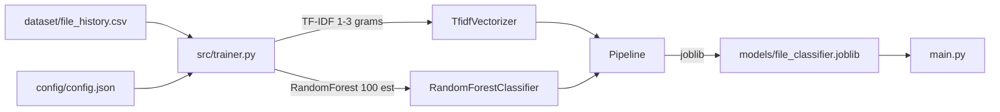

# Smart File Organizer

Multi-class file classification using TF-IDF and Random Forest. Predicts target directories for files based on filename patterns and history.

## Overview

Classifies files into target directories based on filename patterns and usage history. Trains a Random Forest model on file organization history, exposes a CLI for batch organization, and supports custom configuration.

## Core Architecture



## System Components

| Component | Responsibility |
|---|---|
| `src/trainer.py` | Loads CSV + config, trains TF-IDF + RandomForest pipeline |
| `config/config.json` | Target directory mappings and rules |
| `main.py` | Entry point for training and file organization |

## Technology Stack

| Layer | Technology | Purpose |
|---|---|---|
| Language | Python 3.8+ | Core implementation |
| ML | scikit-learn | TF-IDF, Random Forest |
| Serialization | joblib | Model persistence |
| Data | CSV + JSON | Training data and configuration |

## Requirements

- Python 3.8+
- pip

## Configuration

| File | Purpose |
|---|---|
| `requirements.txt` | Python dependencies |
| `config/config.json` | Target directory mappings |
| `dataset/file_history.csv` | Training data (gitignored) |

## Getting Started

```bash
cd smart-file-organizer
pip install -r requirements.txt
python main.py   # Train model + organize files
```
